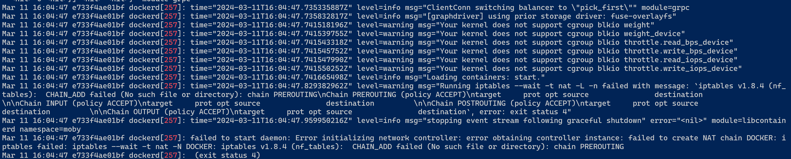

#### Windows (Windows 10 OK, Windows 11 NG)
````
$ docker run --privileged --name manager -itd -p 10022:22 -p 8081:8080 -e container=docker -v /sys/fs/cgroup:/sys/fs/cgroup:rw --cgroupns=host edowon0623/docker:latest /usr/sbin/init

$ docker run --privileged --name worker01 -itd -p 20022:22 -p 8082:8080 -e container=docker -v /sys/fs/cgroup:/sys/fs/cgroup:rw --cgroupns=host edowon0623/docker:latest /usr/sbin/init

$ docker run --privileged --name worker02 -itd -p 30022:22 -p 8083:8080 -e container=docker -v /sys/fs/cgroup:/sys/fs/cgroup:rw --cgroupns=host edowon0623/docker:latest /usr/sbin/init
````

#### Windows (ip-tables 관련 오류 발생 시, Windows 11 OK)

````
$ docker run --privileged --name manager -itd -p 10022:22 -p 8081:8080 -e container=docker -v /sys/fs/cgroup:/sys/fs/cgroup:rw --cgroupns=host edowon0623/docker:no_iptables /usr/sbin/init

$ docker run --privileged --name worker01 -itd -p 20022:22 -p 8082:8080 -e container=docker -v /sys/fs/cgroup:/sys/fs/cgroup:rw --cgroupns=host edowon0623/docker:no_iptables /usr/sbin/init

$ docker run --privileged --name worker02 -itd -p 30022:22 -p 8083:8080 -e container=docker -v /sys/fs/cgroup:/sys/fs/cgroup:rw --cgroupns=host edowon0623/docker:no_iptables /usr/sbin/init
````

#### Apple m1 chip
````
$ docker run --privileged --name manager -itd -p 10022:22 -p 8081:8080 -e container=docker -v /sys/fs/cgroup:/sys/fs/cgroup:rw --cgroupns=host edowon0623/docker-server:m1 /usr/sbin/init

$ docker run --privileged --name worker01 -itd -p 20022:22 -p 8082:8080 -e container=docker -v /sys/fs/cgroup:/sys/fs/cgroup:rw --cgroupns=host edowon0623/docker-server:m1 /usr/sbin/init

$ docker run --privileged --name worker02 -itd -p 30022:22 -p 8083:8080 -e container=docker -v /sys/fs/cgroup:/sys/fs/cgroup:rw --cgroupns=host edowon0623/docker-server:m1 /usr/sbin/init
````

#### Dind 에서 registry 사용 시 (manager, worker01, worker02)
- /etc/docker/daemon.json 파일에 아래 내용 추가
````
{

    "insecure-registries": ["registry:5000"]

}
````

#### Docker Swarm에서 Service 생성
````
$ manager> docker service create --replicas 1 --publish 80:80 --name nginx registry:5000/edowon0623/nginx:latest
$ manager> docker service ls 
$ manager> docker service scale nginx=3
$ manager> docker service ps nginx
$ manager> docker service rm nginx
````


#### Docker Swarm에서 Stack 생성
````
$ manager> docker network create --driver overlay my-overlay-network
$ manager> docker stack deploy -c /stack/stack_sample.yml nginx
$ manager> docker stack ls 
$ manager> docker stack services nginx 
$ manager> docker stack ps nginx
$ manager> docker service rm nginx
````


